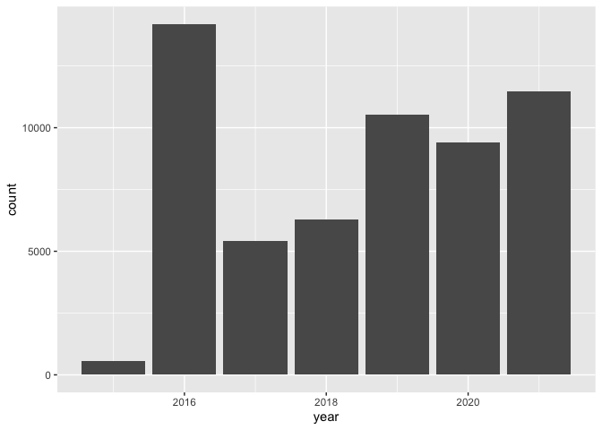

Phenotypes associated with rare diseases
================
Jennifer HY Lin
2022-07-27

``` r
library(tidyverse)
library(lubridate)
library(ggplot2)
library(knitr)
```

#### Initial data wrangling

This dataset was also derived and downloaded from Orphanet, as another
part in the “rare diseases” series. It contained 37 columns with 112,243
rows originally, which took quite a long time to load on RStudio (or
could be due to my laptop capacity…). It loaded relatively faster on
Jupyter notebook from Anaconda, so I then decided to clean it up first
using Python there. Some columns were removed which reduced the total
number of columns from 37 to 13, while not changing any of the rows at
all. The columns were also renamed to make it easier to read.

#### Source of dataset

-   Orphadata: Free access data from Orphanet. © INSERM 1999. Available
    on <http://www.orphadata.org>. Data version (XML data version).
    Dataset (.xml file) from
    <http://www.orphadata.org/cgi-bin/epidemio.html>. Latest date of
    update for the dataset: 14/6/2022 (last accessed 24/7/2022).
    Creative Commons Attribution 4.0 International.

``` r
df <- read_csv("rare_disease_phenotypes.csv")
```

    ## Rows: 112243 Columns: 13
    ## ── Column specification ────────────────
    ## Delimiter: ","
    ## chr  (10): Disorder group, Disorder ...
    ## dbl   (2): HPO disorder & clinical e...
    ## dttm  (1): Validation date
    ## 
    ## ℹ Use `spec()` to retrieve the full column specification for this data.
    ## ℹ Specify the column types or set `show_col_types = FALSE` to quiet this message.

Note: HPO = human phenotype ontology

``` r
spec(df)
```

    ## cols(
    ##   `Disorder group` = col_character(),
    ##   `Disorder type` = col_character(),
    ##   `HPO disorder & clinical entity association count` = col_double(),
    ##   `Diagnostic criteria` = col_character(),
    ##   `HPO frequency` = col_character(),
    ##   `HPO ID` = col_character(),
    ##   `Preferred HPO term` = col_character(),
    ##   `Disorder name` = col_character(),
    ##   `Disorder Orphacode` = col_double(),
    ##   Online = col_character(),
    ##   Source = col_character(),
    ##   `Validation date` = col_datetime(format = ""),
    ##   `Validation status` = col_character()
    ## )

``` r
df %>% View()
```

#### Exploratory data analysis

Since I wasn’t intending for this project to be extremely long (as most
people would likely lose interests by then), I’d like to first ask a
question about the dataset, in order to keep it at a reasonably short
but informative length. So, here’s the question: what are the most
common rare disorders and their associated phenotypic features?

To answer it, let’s observe the spread of the disorder groups and types
first by formulating a contingency table.

``` r
df_type <- df %>% 
  group_by(`Disorder group`,`Disorder type`) %>% 
  summarise(Number = n())
df_type
```

    ## # A tibble: 11 × 3
    ## # Groups:   Disorder group [3]
    ##    `Disorder group`    Disorder…¹ Number
    ##    <chr>               <chr>       <int>
    ##  1 Disorder            Biologica…     41
    ##  2 Disorder            Clinical …    661
    ##  3 Disorder            Disease     57920
    ##  4 Disorder            Malformat…  37634
    ##  5 Disorder            Morpholog…   2644
    ##  6 Disorder            Particula…    418
    ##  7 Group of disorders  Category      479
    ##  8 Group of disorders  Clinical …    952
    ##  9 Subtype of disorder Clinical …   7394
    ## 10 Subtype of disorder Etiologic…   4060
    ## 11 Subtype of disorder Histopath…     40
    ## # … with abbreviated variable name
    ## #   ¹​`Disorder type`

After a quick view on the column of “Disorder group”, it mainly provided
different disorder types a group label for each, which to a certain
extent, was not necessary at this early stage. So this column was
removed for now from the contingency table, in order to focus solely on,
“Disorder type” with the number of counts (or times it appeared in the
dataset).

``` r
df_type <- df %>% 
  group_by(`Disorder type`) %>% 
  summarise(Number = n())
df_type
```

    ## # A tibble: 11 × 2
    ##    `Disorder type`                Number
    ##    <chr>                           <int>
    ##  1 Biological anomaly                 41
    ##  2 Category                          479
    ##  3 Clinical group                    952
    ##  4 Clinical subtype                 7394
    ##  5 Clinical syndrome                 661
    ##  6 Disease                         57920
    ##  7 Etiological subtype              4060
    ##  8 Histopathological subtype          40
    ##  9 Malformation syndrome           37634
    ## 10 Morphological anomaly            2644
    ## 11 Particular clinical situation…    418

Then to visualise this in a graphic way, a lollypop chart was built
horizontally, with different types of rare disorders on the y-axis and
the number of each type on the x-axis.

``` r
ggplot(data = df_type, aes(x = `Disorder type`, y = `Number`)) +
  geom_segment(aes(x = `Disorder type`, xend = `Disorder type`, y = 0, yend = `Number`), colour = "dark blue") +
  geom_point(colour = "dark green", size = 2, alpha = 0.6) +
  theme_light() +
  coord_flip() 
```

<!-- -->

Two disorder types stood out the most, with “Disease” type appeared
57,920 times and “Malformation syndrome” at 37,634 times. To understand
further what each of these two disorder types were, a direct reference
was used (see note below). According to the source of the dataset:

The definition of “Disease” in the rare disorder context was “a disorder
with homogeneous therapeutic possibilities and an identified
physiopathological mechanism…”, one thing also worth noting was that
this type did not include any developmental anomalies.

For “Malformation syndrome”, this was defined as, “A disorder resulting
from a developmental anomaly involving more than one morphogenetic
field. Malformative sequences and associations are included.”

Reference: “Orphadata: Free access products description” - April 2020.
<http://www.orphadata.org/cgi-bin/img/PDF/OrphadataFreeAccessProductsDescription.pdf>.
Version 2

To demonstrate this in a tabular form, with corresponding proportions of
each disorder type in the dataset, the following codes were used:

``` r
df1 <- df %>% 
  group_by(`Disorder type`) %>% 
  summarise(n = n()) %>% 
  mutate(prop = n/sum(n))
df1
```

    ## # A tibble: 11 × 3
    ##    `Disorder type`             n    prop
    ##    <chr>                   <int>   <dbl>
    ##  1 Biological anomaly         41 3.65e-4
    ##  2 Category                  479 4.27e-3
    ##  3 Clinical group            952 8.48e-3
    ##  4 Clinical subtype         7394 6.59e-2
    ##  5 Clinical syndrome         661 5.89e-3
    ##  6 Disease                 57920 5.16e-1
    ##  7 Etiological subtype      4060 3.62e-2
    ##  8 Histopathological subt…    40 3.56e-4
    ##  9 Malformation syndrome   37634 3.35e-1
    ## 10 Morphological anomaly    2644 2.36e-2
    ## 11 Particular clinical si…   418 3.72e-3

The table was then rearranged with proportions in descending order (from
highest to lowest). It also showed the top two were “Disease” (51.6%)
and “Malformation syndrome” (33.5%).

``` r
df1 %>% arrange(desc(prop))
```

    ## # A tibble: 11 × 3
    ##    `Disorder type`             n    prop
    ##    <chr>                   <int>   <dbl>
    ##  1 Disease                 57920 5.16e-1
    ##  2 Malformation syndrome   37634 3.35e-1
    ##  3 Clinical subtype         7394 6.59e-2
    ##  4 Etiological subtype      4060 3.62e-2
    ##  5 Morphological anomaly    2644 2.36e-2
    ##  6 Clinical group            952 8.48e-3
    ##  7 Clinical syndrome         661 5.89e-3
    ##  8 Category                  479 4.27e-3
    ##  9 Particular clinical si…   418 3.72e-3
    ## 10 Biological anomaly         41 3.65e-4
    ## 11 Histopathological subt…    40 3.56e-4

This was followed by checking out the distributions of HPO frequency to
see which categories had the most and least number of counts.

``` r
df_freq <- df %>% 
  count(`HPO frequency`) %>% 
  arrange(desc(n))
df_freq
```

    ## # A tibble: 7 × 2
    ##   `HPO frequency`            n
    ##   <chr>                  <int>
    ## 1 Occasional (29-5%)     41140
    ## 2 Frequent (79-30%)      37480
    ## 3 Very frequent (99-80%) 25892
    ## 4 Very rare (<4-1%)       6414
    ## 5 Excluded (0%)            705
    ## 6 Obligate (100%)          610
    ## 7 <NA>                       2

Results for rare disorders with obligate or 100% frequency in patient’s
populations were then filtered, showing disorder type, HPO frequency and
disorder name. Specifically, I wanted to find out the disorder names
associated with the “Disease” disorder type with HPO frequency of
“Obligate (100%)”.

``` r
df_freq_ob <- df %>% 
  filter(`Disorder type` == "Disease", `HPO frequency` == "Obligate (100%)") %>% 
  select(`Disorder type`, `HPO frequency`, `Disorder name`)
df_freq_ob
```

    ## # A tibble: 404 × 3
    ##    `Disorder type` HPO frequen…¹ Disor…²
    ##    <chr>           <chr>         <chr>  
    ##  1 Disease         Obligate (10… Retino…
    ##  2 Disease         Obligate (10… Parath…
    ##  3 Disease         Obligate (10… Pituit…
    ##  4 Disease         Obligate (10… Famili…
    ##  5 Disease         Obligate (10… Famili…
    ##  6 Disease         Obligate (10… Ravine…
    ##  7 Disease         Obligate (10… Ravine…
    ##  8 Disease         Obligate (10… Inters…
    ##  9 Disease         Obligate (10… Inters…
    ## 10 Disease         Obligate (10… PLIN1-…
    ## # … with 394 more rows, and abbreviated
    ## #   variable names ¹​`HPO frequency`,
    ## #   ²​`Disorder name`
    ## # ℹ Use `print(n = ...)` to see more rows

I’d then like to look into associated counts of appearance of each
disorder name. When I cross-checked with the full dataset in table view,
I’ve noted that the number of appearance of each disorder name is linked
to the number of preferred HPO phenotype terms for each of these
disorder types.

``` r
df2 <- df_freq_ob %>% 
  count(`Disorder name`) 
df2 %>% arrange(desc(n))
```

    ## # A tibble: 239 × 2
    ##    `Disorder name`                     n
    ##    <chr>                           <int>
    ##  1 Autosomal recessive complex sp…    10
    ##  2 STT3A-CDG                           9
    ##  3 STT3B-CDG                           9
    ##  4 Spastic paraplegia-Paget disea…     8
    ##  5 Oculocutaneous albinism type 5      7
    ##  6 PLIN1-related familial partial…     7
    ##  7 Plummer-Vinson syndrome             5
    ##  8 SSR4-CDG                            5
    ##  9 Cholesterol-ester transfer pro…     4
    ## 10 Isolated follicle stimulating …     4
    ## # … with 229 more rows
    ## # ℹ Use `print(n = ...)` to see more rows

To show this, let’s link preferred HPO terms to a disorder name such as
this one, “Autosomal recessive complex spastic paraplegia due to Kennedy
pathway dysfunction”, which had the “Disease” disorder type with
obligate or 100% HPO frequency.

``` r
df_disease <- df %>% 
  filter(`Disorder type` == "Disease", `HPO frequency` == "Obligate (100%)", `Disorder name` == "Autosomal recessive complex spastic paraplegia due to Kennedy pathway dysfunction") %>% 
  select(`Disorder type`, `HPO frequency`, `Disorder name`, `Preferred HPO term`)
kable(df_disease)
```

| Disorder type | HPO frequency   | Disorder name                                                                     | Preferred HPO term                  |
|:--------------|:----------------|:----------------------------------------------------------------------------------|:------------------------------------|
| Disease       | Obligate (100%) | Autosomal recessive complex spastic paraplegia due to Kennedy pathway dysfunction | Progressive spastic paraplegia      |
| Disease       | Obligate (100%) | Autosomal recessive complex spastic paraplegia due to Kennedy pathway dysfunction | Microcephaly                        |
| Disease       | Obligate (100%) | Autosomal recessive complex spastic paraplegia due to Kennedy pathway dysfunction | Moderately short stature            |
| Disease       | Obligate (100%) | Autosomal recessive complex spastic paraplegia due to Kennedy pathway dysfunction | Nasal, dysarthic speech             |
| Disease       | Obligate (100%) | Autosomal recessive complex spastic paraplegia due to Kennedy pathway dysfunction | Delayed gross motor development     |
| Disease       | Obligate (100%) | Autosomal recessive complex spastic paraplegia due to Kennedy pathway dysfunction | Progressive spasticity              |
| Disease       | Obligate (100%) | Autosomal recessive complex spastic paraplegia due to Kennedy pathway dysfunction | Lower limb hyperreflexia            |
| Disease       | Obligate (100%) | Autosomal recessive complex spastic paraplegia due to Kennedy pathway dysfunction | Ankle clonus                        |
| Disease       | Obligate (100%) | Autosomal recessive complex spastic paraplegia due to Kennedy pathway dysfunction | Retinal pigment epithelial mottling |
| Disease       | Obligate (100%) | Autosomal recessive complex spastic paraplegia due to Kennedy pathway dysfunction | Progressive spastic paraparesis     |

As shown in the dataframe above, under the column name, “Preferred HPO
term”, there were a total of ten different HPO phenotype terms
associated with this particular rare disease with 100% HPO frequency
within the patient population for this specific type of spastic
paraplegia.

By using similar filtering method, we could quickly narrow down any
particular rare disease of interest to find out specific phenotype or
clinical features, along with associated HPO phenotype frequency, for
further investigations.

For “Malformation syndrome”, a similar search process was used to find
out what was the most common phenotypes associated with it.

``` r
df_freq_ma <- df %>% 
  filter(`Disorder type` == "Malformation syndrome", `HPO frequency` == "Obligate (100%)") %>%
  select(`Disorder type`, `HPO frequency`, `Disorder name`)
df_freq_ma
```

    ## # A tibble: 125 × 3
    ##    `Disorder type`       HPO f…¹ Disor…²
    ##    <chr>                 <chr>   <chr>  
    ##  1 Malformation syndrome Obliga… CLAPO …
    ##  2 Malformation syndrome Obliga… CLAPO …
    ##  3 Malformation syndrome Obliga… Weaver…
    ##  4 Malformation syndrome Obliga… Weaver…
    ##  5 Malformation syndrome Obliga… Weaver…
    ##  6 Malformation syndrome Obliga… Weaver…
    ##  7 Malformation syndrome Obliga… Weaver…
    ##  8 Malformation syndrome Obliga… Weaver…
    ##  9 Malformation syndrome Obliga… Lethal…
    ## 10 Malformation syndrome Obliga… Lethal…
    ## # … with 115 more rows, and abbreviated
    ## #   variable names ¹​`HPO frequency`,
    ## #   ²​`Disorder name`
    ## # ℹ Use `print(n = ...)` to see more rows

Count() was used to find out the number of appearance of each disorder
name in descending order.

``` r
df3 <- df_freq_ma %>% 
  count(`Disorder name`)
df3 %>% arrange(desc(n))
```

    ## # A tibble: 40 × 2
    ##    `Disorder name`                     n
    ##    <chr>                           <int>
    ##  1 Hydrocephalus-obesity-hypogona…    12
    ##  2 Pelviscapular dysplasia            11
    ##  3 46,XX disorder of sex developm…     9
    ##  4 X-linked microcephaly-growth r…     9
    ##  5 Severe intellectual disability…     7
    ##  6 Lethal recessive chondrodyspla…     6
    ##  7 Weaver-Williams syndrome            6
    ##  8 SERKAL syndrome                     5
    ##  9 Patent ductus arteriosus-bicus…     4
    ## 10 46,XX gonadal dysgenesis            3
    ## # … with 30 more rows
    ## # ℹ Use `print(n = ...)` to see more rows

To show one of the examples of the most common malformation syndrome
with the most associated phenotypic features (with a total of 12
different phenotypic descriptions):

``` r
df_mal_syn <- df %>%
  filter(`Disorder type` == "Malformation syndrome", `HPO frequency` == "Obligate (100%)", `Disorder name` == "Hydrocephalus-obesity-hypogonadism syndrome") %>% 
  select(`Disorder type`, `HPO frequency`, `Disorder name`, `Preferred HPO term`)
kable(df_mal_syn)
```

| Disorder type         | HPO frequency   | Disorder name                               | Preferred HPO term             |
|:----------------------|:----------------|:--------------------------------------------|:-------------------------------|
| Malformation syndrome | Obligate (100%) | Hydrocephalus-obesity-hypogonadism syndrome | Hydrocephalus                  |
| Malformation syndrome | Obligate (100%) | Hydrocephalus-obesity-hypogonadism syndrome | Short neck                     |
| Malformation syndrome | Obligate (100%) | Hydrocephalus-obesity-hypogonadism syndrome | Gynecomastia                   |
| Malformation syndrome | Obligate (100%) | Hydrocephalus-obesity-hypogonadism syndrome | Hypergonadotropic hypogonadism |
| Malformation syndrome | Obligate (100%) | Hydrocephalus-obesity-hypogonadism syndrome | Intellectual disability, mild  |
| Malformation syndrome | Obligate (100%) | Hydrocephalus-obesity-hypogonadism syndrome | Obesity                        |
| Malformation syndrome | Obligate (100%) | Hydrocephalus-obesity-hypogonadism syndrome | Mitral valve prolapse          |
| Malformation syndrome | Obligate (100%) | Hydrocephalus-obesity-hypogonadism syndrome | Low posterior hairline         |
| Malformation syndrome | Obligate (100%) | Hydrocephalus-obesity-hypogonadism syndrome | High, narrow palate            |
| Malformation syndrome | Obligate (100%) | Hydrocephalus-obesity-hypogonadism syndrome | Cubitus valgus                 |
| Malformation syndrome | Obligate (100%) | Hydrocephalus-obesity-hypogonadism syndrome | Short stature                  |
| Malformation syndrome | Obligate (100%) | Hydrocephalus-obesity-hypogonadism syndrome | Short 4th metacarpal           |

Now, to add one more piece of work towards this exploratory data
analysis, I thought to check out the Validation date column. “Validation
date” in this context meant the dates when the annotations of HPO terms
were made for each rare disorder, which were based on the source
articles listed (as shown in the Source column).

Firstly, I started with the “Disease” disorder type and singled out the
year component from the Validation date column.

``` r
df_val_date <- df %>% 
  mutate(year = year(`Validation date`), label = TRUE, abbr = FALSE)
df_val_date
```

    ## # A tibble: 112,243 × 16
    ##    Disorder gr…¹ Disor…² HPO d…³ Diagn…⁴
    ##    <chr>         <chr>     <dbl> <chr>  
    ##  1 Disorder      Disease      59 Diagno…
    ##  2 Disorder      Disease      59 Diagno…
    ##  3 Disorder      Disease      59 Diagno…
    ##  4 Disorder      Disease      59 Diagno…
    ##  5 Disorder      Disease      59 Diagno…
    ##  6 Disorder      Disease      59 Diagno…
    ##  7 Disorder      Disease      59 Diagno…
    ##  8 Disorder      Disease      59 Diagno…
    ##  9 Disorder      Disease      59 Diagno…
    ## 10 Disorder      Disease      59 Diagno…
    ## # … with 112,233 more rows, 12 more
    ## #   variables: `HPO frequency` <chr>,
    ## #   `HPO ID` <chr>,
    ## #   `Preferred HPO term` <chr>,
    ## #   `Disorder name` <chr>,
    ## #   `Disorder Orphacode` <dbl>,
    ## #   Online <chr>, Source <chr>, …
    ## # ℹ Use `print(n = ...)` to see more rows, and `colnames()` to see all variable names

To show this in a dataframe, observations for “Disease” disorder type
were shown by using a filter:

``` r
df_val_date_d <- df_val_date %>% 
  select(`Disorder type`, year) %>% 
  filter(`Disorder type` == "Disease")
df_val_date_d
```

    ## # A tibble: 57,920 × 2
    ##    `Disorder type`  year
    ##    <chr>           <dbl>
    ##  1 Disease          2016
    ##  2 Disease          2016
    ##  3 Disease          2016
    ##  4 Disease          2016
    ##  5 Disease          2016
    ##  6 Disease          2016
    ##  7 Disease          2016
    ##  8 Disease          2016
    ##  9 Disease          2016
    ## 10 Disease          2016
    ## # … with 57,910 more rows
    ## # ℹ Use `print(n = ...)` to see more rows

Then to make it easier to visualise, the year counts were plotted in a
bar graph. Interestingly, 2016 seemed to be the year for rare disorders
to be annotated with the most phenotypic features (if referring back to
the original dataset, each observation or row was present for a unique
“Preferred HPO term” or phenotypic abnormality).

``` r
df_val_date_d %>% 
  ggplot(aes(x = year)) +
  geom_bar()
```

    ## Warning: Removed 49 rows containing non-finite
    ## values (stat_count).

<!-- -->

It was also worth noting that there were 49 rows of non-finite values
excluded from the bar graph above. To look into this, a count on the
year column of the dataframe df_val_date_d was done, which confirmed
that these were the “NA” or missing values in the validation date
column.

``` r
df_val_date_d %>% 
  count(year)
```

    ## # A tibble: 8 × 2
    ##    year     n
    ##   <dbl> <int>
    ## 1  2015   567
    ## 2  2016 14193
    ## 3  2017  5419
    ## 4  2018  6297
    ## 5  2019 10525
    ## 6  2020  9402
    ## 7  2021 11468
    ## 8    NA    49

#### Summary

To quickly summarise key findings from this work<sup>1</sup> regarding
phenotypes associated with rare diseases:

-   **Autosomal recessive complex spastic paraplegia due to Kennedy
    pathway dysfunction** was one of the most common rare diseases under
    the Disease disorder type with the most phenotypic abnormalities
    recorded, which were:

1.  progressive spastic paraplegia
2.  microcephaly
3.  moderately short stature
4.  nasal, dysarthic speech
5.  delayed gross motor development
6.  progressive spasticity
7.  lower limb hyperreflexia
8.  ankle clonus
9.  retinal pigment epithelial mottling
10. progressive spastic paraparesis

-   For malformation syndrome of the rare disorder type,
    **Hydrocephalus-obesity-hypogonadism syndrome** was found to be one
    of the most common rare diseases with the most phenotypic
    abnormalities recorded, which were:

1.  hydrocephalus
2.  short neck
3.  gynecomastia
4.  hypergonadotropic hypogonadism
5.  intellectual disability, mild
6.  obesity
7.  mitral valve prolapse
8.  low posterior hairline
9.  high, narrow palate
10. cubitus valgus
11. short stature
12. short 4th metacarpal

-   The year of 2016 had the highest number of HPO terms or phenotypic
    abnormalities annotated to rare disorders from specific named source
    articles, and on the contrary, 2015 had the lowest counts from the
    dataset

##### Footnote:

1.  *It’s possible to dig further into the dataset e.g. diagnostic
    criterion and perhaps even bring back some of the columns removed
    initially, however due to time constraints (due to being a
    one-person team and also I’d like to start on the COVID-19 antiviral
    work soon), I’ll leave some room here for the interested to work on
    the data*
