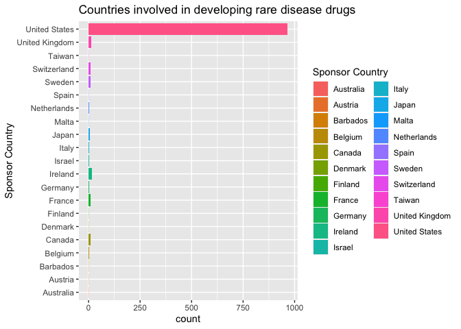
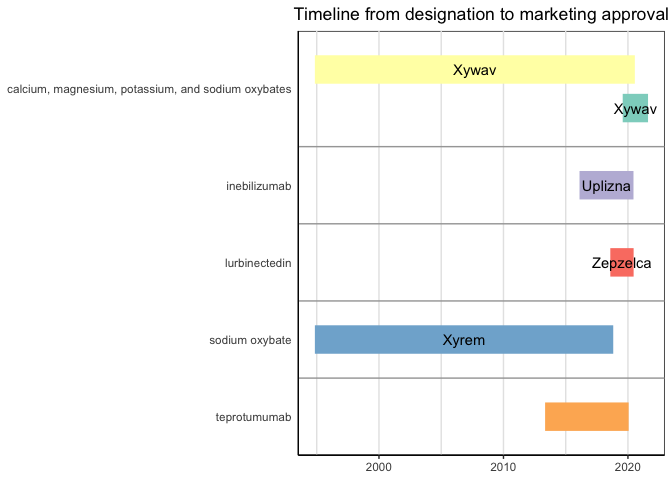

Rare disease drugs from US FDA
================
Jennifer HY Lin
5-7-2022

### Why rare disease drugs?

This work was inspired by Data Is Plural website
[link](https://www.data-is-plural.com), which has provided a diverse and
dynamic range of data available to the public. I happened to come across
it randomly without any intentions and rare disease drugs jumped out
from all of the data available at the time.

Below is an initial dive-in for this particular data set for rare
disease drugs from 1983 till present - downloadable from:
<https://www.accessdata.fda.gov/scripts/opdlisting/oopd/index.cfm> (last
accessed: 1/7/2022). Future work may evolve from this initial part and
perhaps grow further as I’m slowly working on other data available from
Orphanet, a website dedicated to data relevant to rare diseases.

Read .csv file firstly to import the data set.

``` r
library(tidyverse)
```

``` r
df <- read_csv("Rare_diseases_drugs_FDA.csv")
```

    ## Rows: 1058 Columns: 18
    ## ── Column specification ─────────────────────────────────────────────────────
    ## Delimiter: ","
    ## chr (16): Generic Name, Trade Name, Date Designated, Orphan Designation, ...
    ## dbl  (1): CF Grid Key
    ## lgl  (1): FDA Orphan Approval Status
    ## 
    ## ℹ Use `spec()` to retrieve the full column specification for this data.
    ## ℹ Specify the column types or set `show_col_types = FALSE` to quiet this message.

Inspect all column names in the data set and also open full data set in
a separate table view to observe contents.

``` r
spec(df)
```

    ## cols(
    ##   `Generic Name` = col_character(),
    ##   `Trade Name` = col_character(),
    ##   `Date Designated` = col_character(),
    ##   `Orphan Designation` = col_character(),
    ##   `Orphan Designation Status` = col_character(),
    ##   `FDA Orphan Approval Status` = col_logical(),
    ##   `Approved Labeled Indication` = col_character(),
    ##   `Marketing Approval Date` = col_character(),
    ##   `Exclusivity End Date` = col_character(),
    ##   `Exclusivity Protected Indication * (Shown for approvals from Jan. 1, 2013, to the present)` = col_character(),
    ##   `Sponsor Company` = col_character(),
    ##   `Sponsor Address 1` = col_character(),
    ##   `Sponsor Address 2` = col_character(),
    ##   `Sponsor City` = col_character(),
    ##   `Sponsor State` = col_character(),
    ##   `Sponsor Zip` = col_character(),
    ##   `Sponsor Country` = col_character(),
    ##   `CF Grid Key` = col_double()
    ## )

``` r
df %>% View()
```

### Data analysis

After perusing the data set, I’ve decided to focus on selected columns
only so that I can concentrate on these data without seeing other minor
details at this stage.

``` r
select(df, `Generic Name`, `Trade Name`, `Date Designated`, `Orphan Designation`, `Approved Labeled Indication`, `Marketing Approval Date`, `Exclusivity Protected Indication * (Shown for approvals from Jan. 1, 2013, to the present)`, `Sponsor Country`)
```

    ## # A tibble: 1,058 × 8
    ##    `Generic Name`              `Trade Name` `Date Designat…` `Orphan Design…`
    ##    <chr>                       <chr>        <chr>            <chr>           
    ##  1 bosentan                    Tracleer     10/06/00         Treatment of pu…
    ##  2 bosentan                    Tracleer     10/06/00         Treatment of pu…
    ##  3 (tisagenlecleucel) Autolog… Kymriah (ti… 01/31/2014       For the treatme…
    ##  4 5-aminolevulinic acid       Gleolan      01/15/2013       Visualization o…
    ##  5 abatacept                   Orencia      12/26/2017       Prevention of g…
    ##  6 acalabrutinib               CALQUENCE    09/21/2015       Treatment of ma…
    ##  7 acalabrutinib               <NA>         05/13/2015       Treatment of ch…
    ##  8 acetylcysteine              Acetadote    10/19/2001       For the intrave…
    ##  9 acetylcysteine effervescen… Cetylev      02/24/2015       Preventing hepa…
    ## 10 acyclovir                   Avaclyr      12/13/2010       Treatment of ac…
    ## # … with 1,048 more rows, and 4 more variables:
    ## #   `Approved Labeled Indication` <chr>, `Marketing Approval Date` <chr>,
    ## #   `Exclusivity Protected Indication * (Shown for approvals from Jan. 1, 2013, to the present)` <chr>,
    ## #   `Sponsor Country` <chr>

I’m interested in finding out what countries were involved in developing
rare disease drugs and also how frequently each of these drugs appeared
in the data set from 1983 till present. So I’ve done a simple count() on
sponsor country column to see the distributions.

``` r
df %>% count(`Sponsor Country`)
```

    ## # A tibble: 22 × 2
    ##    `Sponsor Country`     n
    ##    <chr>             <int>
    ##  1 Australia             1
    ##  2 Austria               1
    ##  3 Barbados              1
    ##  4 Belgium               2
    ##  5 Canada                8
    ##  6 Denmark               1
    ##  7 Finland               1
    ##  8 France               10
    ##  9 Germany               4
    ## 10 Ireland              16
    ## # … with 12 more rows

I’ve noticed the last row was actually not a data entry, but rather a
caption about exclusivity indication and period so this was removed from
the newly created dataframe df1.

``` r
df1 = df %>% slice(-c(1058))
```

The count was then repeated, which had the last row removed as shown in
the table.

``` r
df1 %>% count(`Sponsor Country`)
```

    ## # A tibble: 21 × 2
    ##    `Sponsor Country`     n
    ##    <chr>             <int>
    ##  1 Australia             1
    ##  2 Austria               1
    ##  3 Barbados              1
    ##  4 Belgium               2
    ##  5 Canada                8
    ##  6 Denmark               1
    ##  7 Finland               1
    ##  8 France               10
    ##  9 Germany               4
    ## 10 Ireland              16
    ## # … with 11 more rows

A horizontal bar graph was plotted to show countries involved in rare
disease drug developments (by counts, which might include duplicates
such as different formulations under the same trade names and so on,
I’ve decided to include them all for now). It showed United States had
the highest counts of 966, which were followed by Ireland (16), then
United Kingdom (13) and also other countries.

``` r
ggplot(data = df1) +
  geom_bar(mapping = aes(x = `Sponsor Country`, fill = `Sponsor Country`)) +
  labs(title = "Countries involved in developing rare disease drugs") +
  coord_flip()
```

<!-- -->

#### Rare disease drugs from the UK

I’ve then decided to look into rare disease drugs with exclusivity end
date after the year of 2022 and also limited the sponsor country to UK
only. This was done using filter(). To show this result visually, a
timeline was plotted using vistime package (thanks to vistime package
creator, Sandro Raabe). The format of the dates in the data set was also
changed first, so that the timeline could be plotted.

``` r
library(lubridate)
library(dplyr)
```

``` r
df_uk <- df %>% 
  mutate(`Exclusivity End Date` = mdy(`Exclusivity End Date`), `Date Designated` = mdy(`Date Designated`), `Marketing Approval Date` = mdy(`Marketing Approval Date`)) %>%
  filter(year(`Exclusivity End Date`) > 2022 & `Sponsor Country` == "United Kingdom")
df_uk
```

    ## # A tibble: 8 × 18
    ##   `Generic Name`               `Trade Name` `Date Designat…` `Orphan Design…`
    ##   <chr>                        <chr>        <date>           <chr>           
    ## 1 belantamab mafodotin-blmf    BLENREP      2017-06-22       Treatment of mu…
    ## 2 cannabidiol                  Epidiolex    2014-02-27       Treatment of Le…
    ## 3 cannabidiol                  Epidiolex    2013-11-14       Treatment of Dr…
    ## 4 cannabidiol                  Epidiolex    2016-04-19       Treatment of tu…
    ## 5 cannabidiol                  EPIDIOLEX    2014-02-27       Treatment of Le…
    ## 6 cannabidiol                  EPIDIOLEX    2013-11-14       Treatment of Dr…
    ## 7 Coagulation factor X (human) COAGADEX     2007-11-08       Treatment of he…
    ## 8 tafenoquine                  Krintafel    2013-01-15       Treatment of ma…
    ## # … with 14 more variables: `Orphan Designation Status` <chr>,
    ## #   `FDA Orphan Approval Status` <lgl>, `Approved Labeled Indication` <chr>,
    ## #   `Marketing Approval Date` <date>, `Exclusivity End Date` <date>,
    ## #   `Exclusivity Protected Indication * (Shown for approvals from Jan. 1, 2013, to the present)` <chr>,
    ## #   `Sponsor Company` <chr>, `Sponsor Address 1` <chr>,
    ## #   `Sponsor Address 2` <chr>, `Sponsor City` <chr>, `Sponsor State` <chr>,
    ## #   `Sponsor Zip` <chr>, `Sponsor Country` <chr>, `CF Grid Key` <dbl>

``` r
library(vistime)
```

The timeline shown below starts from the date of designation to
marketing approval for all of the rare disease drugs under this
particular filter.

-   years on x-axis
-   generic names on y-axis
-   trade names on top of timeline bars

``` r
gg_vistime(df_uk, col.event = "Trade Name", col.group = "Generic Name", col.start = "Date Designated", col.end = "Marketing Approval Date", title = "Timeline from designation to marketing approval")
```

<!-- -->

#### Rare disease drugs from Ireland

For rare diseases drugs from Ireland, I’ve also changed the date formats
and then selected the ones with exclusivity end date after 2022.

``` r
df_ir <- df %>%
  mutate(`Exclusivity End Date` = mdy(`Exclusivity End Date`), `Date Designated` = mdy(`Date Designated`), `Marketing Approval Date` = mdy(`Marketing Approval Date`)) %>%
  filter(year(`Exclusivity End Date`) > 2022, `Sponsor Country` == "Ireland")
df_ir
```

    ## # A tibble: 6 × 18
    ##   `Generic Name`               `Trade Name` `Date Designat…` `Orphan Design…`
    ##   <chr>                        <chr>        <date>           <chr>           
    ## 1 calcium, magnesium, potassi… Xywav        2019-07-31       Treatment of id…
    ## 2 calcium, magnesium, potassi… Xywav        1994-11-07       Treatment of na…
    ## 3 inebilizumab                 Uplizna      2016-02-10       Treatment of ne…
    ## 4 lurbinectedin                Zepzelca     2018-08-01       Treatment of sm…
    ## 5 sodium oxybate               Xyrem        1994-11-07       Treatment of na…
    ## 6 teprotumumab                 <NA>         2013-05-06       Treatment of ac…
    ## # … with 14 more variables: `Orphan Designation Status` <chr>,
    ## #   `FDA Orphan Approval Status` <lgl>, `Approved Labeled Indication` <chr>,
    ## #   `Marketing Approval Date` <date>, `Exclusivity End Date` <date>,
    ## #   `Exclusivity Protected Indication * (Shown for approvals from Jan. 1, 2013, to the present)` <chr>,
    ## #   `Sponsor Company` <chr>, `Sponsor Address 1` <chr>,
    ## #   `Sponsor Address 2` <chr>, `Sponsor City` <chr>, `Sponsor State` <chr>,
    ## #   `Sponsor Zip` <chr>, `Sponsor Country` <chr>, `CF Grid Key` <dbl>

The timeline is shown below starting from the date of designation to
marketing approval.

-   years on x-axis
-   generic names on y-axis
-   trade names on top of timeline bars (note: teprotumumab had no trade
    name recorded in the data set so it was not shown in timeline)

``` r
gg_vistime(df_ir, col.event = "Trade Name", col.group = "Generic Name", col.start = "Date Designated", col.end = "Marketing Approval Date", title = "Timeline from designation to marketing approval")
```

<!-- -->

#### Rare disease drugs from the US

Since there are a larger number of rare disease drugs from the US, I’ve
applied a filter to limit to the year of 2022 only and between the
months of January to June - in order to observe the ones that still have
exclusivity during this period. All date formats were also changed
before the timeline was plotted.

``` r
df_us <- df %>%
  mutate(`Exclusivity End Date` = mdy(`Exclusivity End Date`), `Date Designated` = mdy(`Date Designated`), `Marketing Approval Date` = mdy(`Marketing Approval Date`)) %>%
  filter(year(`Exclusivity End Date`) == 2022, month(`Exclusivity End Date`) >= 1, month(`Exclusivity End Date`) < 7, `Sponsor Country` == "United States")
df_us
```

    ## # A tibble: 15 × 18
    ##    `Generic Name`              `Trade Name` `Date Designat…` `Orphan Design…`
    ##    <chr>                       <chr>        <date>           <chr>           
    ##  1 Antivenin crotaline (pit-v… Anavip       2004-01-29       Treatment of en…
    ##  2 cholic acid                 Cholbam      2003-07-18       Treatment of in…
    ##  3 dinutuximab                 Unituxin     2010-12-20       Treatment of ne…
    ##  4 filgrastim                  Neupogen     2013-11-20       Treatment of su…
    ##  5 ibrutinib                   Imbruvica    2013-10-15       Treatment of Wa…
    ##  6 isavuconazonium sulfate     Cresemba     2013-05-06       Treatment of in…
    ##  7 isavuconazonium sulfate     Cresemba     2013-10-25       Treatment of zy…
    ##  8 ivacaftor                   Kalydeco     2006-12-20       Treatment of pa…
    ##  9 lenalidomide                Revlimid     2001-09-20       Treatment of mu…
    ## 10 lenvatinib                  Lenvima      2012-12-27       Treatment of fo…
    ## 11 levodopa and carbidopa      Duopa        2000-01-18       Treatment of la…
    ## 12 panobinostat                Farydak      2012-08-20       Treatment of mu…
    ## 13 parathyroid hormone         Natpara      2007-08-31       Treatment of hy…
    ## 14 phoxillum                   <NA>         2014-02-14       For use as a re…
    ## 15 sirolimus                   Rapamune     2012-10-31       Treatment of ly…
    ## # … with 14 more variables: `Orphan Designation Status` <chr>,
    ## #   `FDA Orphan Approval Status` <lgl>, `Approved Labeled Indication` <chr>,
    ## #   `Marketing Approval Date` <date>, `Exclusivity End Date` <date>,
    ## #   `Exclusivity Protected Indication * (Shown for approvals from Jan. 1, 2013, to the present)` <chr>,
    ## #   `Sponsor Company` <chr>, `Sponsor Address 1` <chr>,
    ## #   `Sponsor Address 2` <chr>, `Sponsor City` <chr>, `Sponsor State` <chr>,
    ## #   `Sponsor Zip` <chr>, `Sponsor Country` <chr>, `CF Grid Key` <dbl>

The timeline for this particular set of rare disease drugs from the US
is shown below.

-   years on x-axis
-   generic names on y-axis
-   trade names on top of timeline bars (note: phoxillum had no trade
    name recorded in the data set so it was not shown in the timeline)

``` r
gg_vistime(df_us, col.event = "Trade Name", col.group = "Generic Name", col.start = "Date Designated", col.end = "Marketing Approval Date", title = "Timeline from designation to marketing approval")
```

<!-- -->

### Conclusion

This short dive-in session on this set of data on rare disease drugs has
shown that the US is the country that has the most involvement in rare
disease drug developments, which is followed by Ireland and the UK, and
also a number of other countries. The timelines have also implied that
drug discovery and development is a timely process, which could span
many years (e.g. 10 - 20 years or more) before a drug actually reaches
marketing approval.
